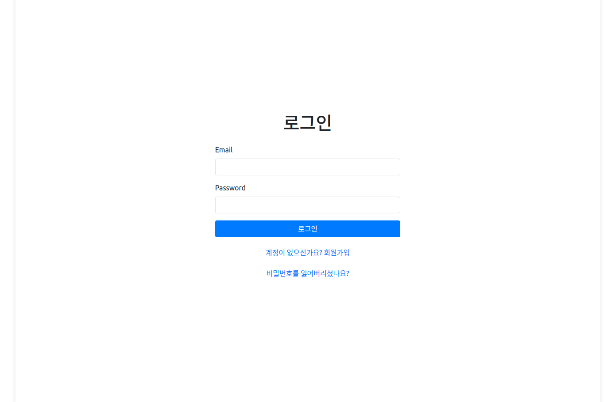
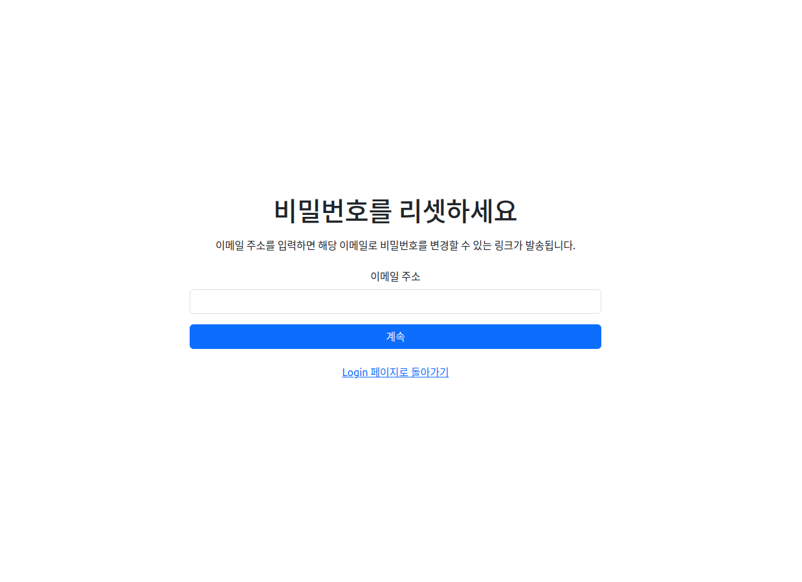
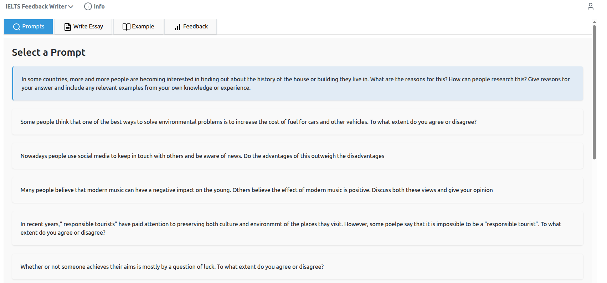
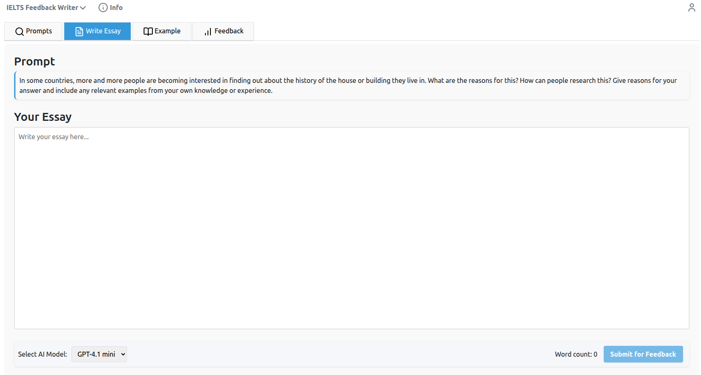
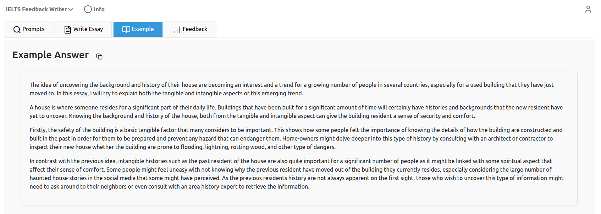
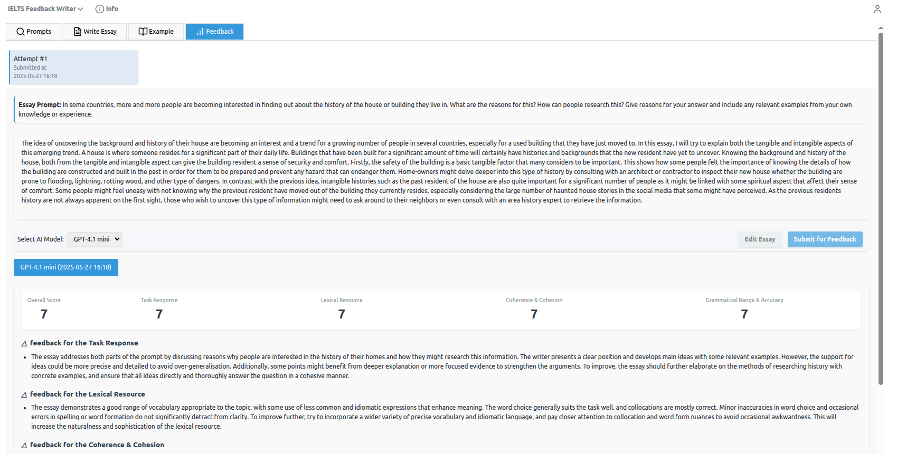

# Essay Feedback Writer 프로젝트


[](https://github.com/limJhyeok/Essay-Feedback-Writer/actions/workflows/test-backend.yml)
<a href="https://coverage-badge.samuelcolvin.workers.dev/redirect/limJhyeok/Essay-Feedback-Writer" target="_blank"></a>

**언어 선택 / Language Selection:**

<p align="left">
    한국어&nbsp ｜ &nbsp<a href="README.md">English</a>&nbsp
</p>
## 기술 스택 및 기능

- ⚡ [**FastAPI**](https://fastapi.tiangolo.com): Python 백엔드 API 구축.
    - 🧰 [SQLAlchemy](https://www.sqlalchemy.org/): Python SQL 데이터베이스 상호작용(ORM) 처리 — `AsyncSession`을 이용한 완전 비동기 아키텍처.
    - 🔍 [Pydantic](https://docs.pydantic.dev): FastAPI에서 사용하며 데이터 유효성 검사 및 설정 관리.
    - 💾 [PostgreSQL](https://www.postgresql.org): 데이터베이스 사용.
    - 📁 [Adminer](https://www.adminer.org/): 데이터베이스 관리 시스템.
- 🚀 [Svelte](https://svelte.dev/): 프론트엔드.
- ✍️ 스타일러스/터치 필기 입력 및 VLM 기반 OCR을 통한 손글씨 에세이 제출 기능.
- 🐋 [Docker Compose](https://www.docker.com): 개발 및 배포 환경.
- 🔒 기본적인 비밀번호 해싱 기능.
- 🔑 JWT (JSON Web Token) 인증.
- 📫 이메일 기반 비밀번호 복구.
- ✅ [Pytest](https://pytest.org) 및 [pytest-asyncio](https://pytest-asyncio.readthedocs.io/): 테스트.
- 📞 [Traefik](https://traefik.io): 리버스 프록시 / 로드 밸런서.
- 🚢 Docker Compose를 사용한 배포 지침, 자동 HTTPS 인증서를 처리하는 프론트엔드 Traefik 프록시 설정.

### 대시보드 로그인

[](https://github.com/limJhyeok/ChatGPT-Clone)

### 대시보드 비밀번호 복구
[](https://github.com/limJhyeok/ChatGPT-Clone)

### 대시보드 에세이 프롬프트 선택
[](https://github.com/limJhyeok/Essay-Feedback-Writer)

### 대시보드 에세이 작성
[](https://github.com/limJhyeok/Essay-Feedback-Writer)

### 대시보드 에세이 예시
[](https://github.com/limJhyeok/Essay-Feedback-Writer)

### 대시보드 AI 피드백
[](https://github.com/limJhyeok/Essay-Feedback-Writer)

### .env 파일 설정
루트 폴더에 **.env** 파일을 만들어 주세요.
```
PROJECT_NAME="Essay Feedback Writer"
STACK_NAME="Essay Feedback Writer"
DOMAIN=localhost

# 백엔드 URL
VITE_SERVER_URL=http://127.0.0.1:8000 # backend(CPU)

# 프론트엔드 URL
BACKEND_CORS_ORIGINS="http://localhost,http://localhost:5173,http://127.0.0.1:5173,https://localhost,https://localhost:5173,https://127.0.0.1:5173"
DOMAIN_PORT="5173"

USE_HASH_ROUTER = "True"
ACCESS_TOKEN_EXPIRE_MINUTES = 60

# 인증을 위한 secret key 및 알고리즘
SECRET_KEY =
ALGORITHM =

# AI API key 암호화 및 복호화용 secret key(e.g. OpenAI API Key)
FERNET_SECRET =

SMTP_HOST = "smtp.gmail.com"
SMTP_PORT = 587
SMTP_USERNAME =
SMTP_PASSWORD =
EMAILS_FROM_EMAIL = "info@example.com"
EMAILS_FROM_NAME = "Essay Feedback Writer Information"

# Postgres 설정
## Dev(or Prod) DB
POSTGRES_SERVER=localhost
POSTGRES_PORT=5432
POSTGRES_DB=app
POSTGRES_USER=postgres
POSTGRES_PASSWORD=changethis
## Test DB
TEST_POSTGRES_SERVER=localhost
TEST_POSTGRES_PORT=5432
TEST_POSTGRES_DB=test
TEST_POSTGRES_USER=postgres
TEST_POSTGRES_PASSWORD=changethis

# SUper user용 AI API Key
OPENAI_API_KEY=sk-....
```
- **PROJECT_NAME**: 프로젝트 이름
- **STACK_NAME**: Docker Compose 라벨 및 프로젝트 이름(공백 및 마침표 제외) (이 값은 .env에 설정)
- **DOMAIN**: 기본값은 개발용 localhost이며, 배포 시에는 본인의 도메인으로 설정합니다.
- **ENVIRONMENT**: 기본값은 개발용 local이며, 서버에 배포할 때는 staging 또는 production과 같은 값을 설정합니다.
- **SECRET_KEY**: 프로젝트의 보안을 위한 secret key, .env 파일에 저장.
- **SMTP_USERNAME**: 이메일 전송을 위한 SMTP 서버 사용자명.
- **SMTP_PASSWORD**: 이메일 전송을 위한 SMTP 서버 비밀번호.
- **OPENAI_API_KEY**: Super user용 AI key


### Docker Compose로 컨테이너 실행
```bash
sudo docker-compose up
```
위 명령어를 통해 다음의 컨테이너가 생성됩니다:
- 리버스 프록시(Traefik)
- 데이터베이스(PostgreSQL)
- 백엔드(FastAPI)
- 프론트엔드(Svelte)
- 데이터베이스 관리 시스템(Adminer)

예시)
```bash
[+] Building 0.0s (0/0)                                                                                                                                                               docker:default
[+] Running 5/0
 ✔ Container chatgpt-clone-proxy-1    Created                                                                                                                                                   0.0s
 ✔ Container chatgpt-clone-db-1       Created                                                                                                                                                   0.0s
 ✔ Container backend                  Created                                                                                                                                                   0.0s
 ✔ Container frontend                 Created                                                                                                                                                   0.0s
 ✔ Container chatgpt-clone-adminer-1  Created                                                                                                                                                   0.0s
Attaching to backend, chatgpt-clone-adminer-1, chatgpt-clone-db-1, chatgpt-clone-proxy-1, frontend
```

### 테스트 환경에서 Docker Compose 실행

테스트 환경에서 컨테이너를 실행하려면 다음 명령어를 사용하세요:
```bash
sudo docker-compose -f docker-compose.yaml -f docker-compose.override.yaml -f docker-compose.test.yaml up
```
위 명령어를 실행하면 개발(dev) 또는 운영(prod) 환경의 데이터베이스와 격리된 테스트 전용 데이터베이스(test DB)가 실행됩니다. test DB는 빠른 임시 스토리지를 위해 **RAM(`tmpfs`)** 기반으로 동작합니다.

백엔드에서 테스트를 수행하면, 해당 데이터가 test DB 에 저장됩니다.
테스트 진행 시 데이터 분리를 위해 test DB 를 사용하는 것을 권장합니다.


## 백엔드 개발
백엔드 문서: [backend/readme.md](backend/README.ko.md)

## 개발

일반적인 개발 문서: [development.md](./development.ko.md).

이 문서에는 Docker Compose 사용, pre-commit, `.env` 설정 등의 내용이 포함되어 있습니다.

## Acknowledgements
이 레포지토리는 [full-stack-fastapi-template](https://github.com/fastapi/full-stack-fastapi-template)를 기반으로 개발되었습니다. 만약 FastAPI를 이용하실 생각이 있으시면 [full-stack-fastapi-template](https://github.com/fastapi/full-stack-fastapi-template)은 좋은 참고자료가 될 것입니다.
```
@online{full-stack-fastapi-template,
  author    = {fastapi},
  title     = {full-stack-fastapi-template},
  url       = {https://github.com/fastapi/full-stack-fastapi-template},
  year      = {2024},
}
```
