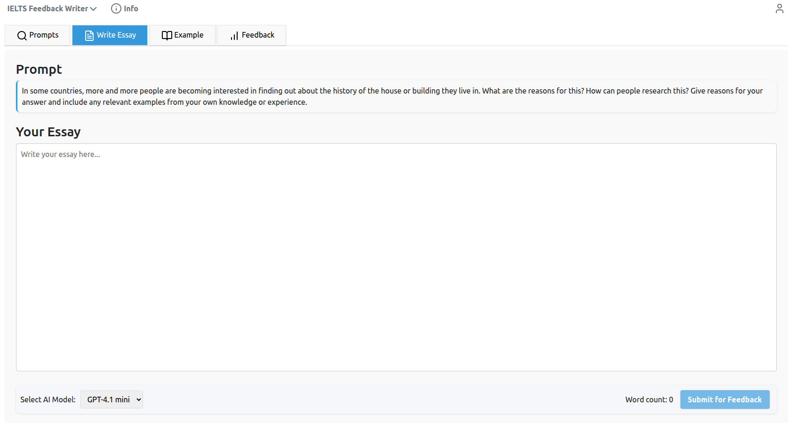

# Essay Feedback Writer Project

[](https://github.com/limJhyeok/Essay-Feedback-Writer/actions/workflows/test-backend.yml)
<a href="https://coverage-badge.samuelcolvin.workers.dev/redirect/limJhyeok/Essay-Feedback-Writer" target="_blank"></a>

<p align="left">
    <a href="README.ko.md">한국어</a>&nbsp ｜ &nbspEnglish&nbsp
</p>

## Technology Stack and Features

- ⚡ [**FastAPI**](https://fastapi.tiangolo.com) for the Python backend API.
    - 🧰 [SQLAlchemy](https://www.sqlalchemy.org/) for the Python SQL database interactions (ORM).
    - 🔍 [Pydantic](https://docs.pydantic.dev) used by FastAPI, for the data validation and settings management.
    - 💾 [PostgreSQL](https://www.postgresql.org) as the SQL database.
    - 📁 [Adminer](https://www.adminer.org/) as the Database Management System
- 🚀 [Svelte](https://svelte.dev/) for the frontend
- 🐋 [Docker Compose](https://www.docker.com) for development and production.
- 🔒 Secure password hashing by default.
- 🔑 JWT (JSON Web Token) authentication.
- 📫 Email based password recovery.
- ✅ Tests with [Pytest](https://pytest.org).
- 📞 [Traefik](https://traefik.io) as a reverse proxy / load balancer.
- 🚢 Deployment instructions using Docker Compose, including how to set up a frontend Traefik proxy to handle automatic HTTPS certificates.

### Dashboard Login

[](https://github.com/limJhyeok/Essay-Feedback-Writer)

### Dashboard password recovery
[](https://github.com/limJhyeok/Essay-Feedback-Writer)

### Dashboard select a prompt
[](https://github.com/limJhyeok/Essay-Feedback-Writer)

### Dashboard write a essay
[](https://github.com/limJhyeok/Essay-Feedback-Writer)

### Dashboard example essay
[](https://github.com/limJhyeok/Essay-Feedback-Writer)

### Dashboard feedback by an AI
[](https://github.com/limJhyeok/Essay-Feedback-Writer)

## How to use it

### .env file setting
please make the **.env** file in the root folder
```
PROJECT_NAME="Essay Feedback Writer"
STACK_NAME="Essay-Feedback-Writer"
DOMAIN=localhost

ENVIRONMENT=local

# backend url
VITE_SERVER_URL=http://127.0.0.1:8000

# frontend url
BACKEND_CORS_ORIGINS="http://localhost,http://localhost:5173,http://127.0.0.1:5173,https://localhost,https://localhost:5173,https://127.0.0.1:5173"
DOMAIN_PORT="5173"

USE_HASH_ROUTER = "True"
ACCESS_TOKEN_EXPIRE_MINUTES = 60

# secret key and algorithm for auth
SECRET_KEY =
ALGORITHM =

# secret key for encode and decode AI API key(e.g. OpenAI API Key)
FERNET_SECRET =

SMTP_HOST = "smtp.gmail.com"
SMTP_PORT = 587
SMTP_USERNAME =
SMTP_PASSWORD =
EMAILS_FROM_EMAIL = "info@example.com"
EMAILS_FROM_NAME = "Essay Feedback Writer Information"

# Postgres
## Dev(or Prod) DB
POSTGRES_SERVER=localhost
POSTGRES_PORT=5432
POSTGRES_DB=app
POSTGRES_USER=postgres
POSTGRES_PASSWORD=changethis
## Test DB
TEST_POSTGRES_SERVER=localhost
TEST_POSTGRES_PORT=5432
TEST_POSTGRES_DB=test
TEST_POSTGRES_USER=postgres
TEST_POSTGRES_PASSWORD=changethis

# AI API KEY for superuser
OPENAI_API_KEY=sk-....
```
- **PROJECT_NAME**:  The name of the project
- **STACK_NAME**: The name of the stack used for Docker Compose labels and project name (no spaces, no periods) (in .env).
- **DOMAIN**: Set the `DOMAIN`, by default localhost (for development), but when deploying you would use your own domain,
- **ENVIRONMENT**: Set the `ENVIRONMENT`, by default local (for development), but when deploying to a server you would put something like `staging` or `production`
- **SECRET_KEY**: The secret key for the project, used for security, stored in .env.
- **SMTP_USERNAME**: The SMTP server user to send emails.
- **SMTP_PASSWORD**: The SMTP server password to send emails.
- **OPENAI_API_KEY**: OpenAI API Key for the super user

### Execute Containers using docker compsoe
```bash
sudo docker-compose up
```
it will make the containeres
- reverse proxy(Traefik)
- Database(PostgreSQL)
- backend(FastAPI)
- frontend(Svelte)
- Database Management System(Adminer)

for example)
```bash
[+] Building 0.0s (0/0)                                                                                                                                                               docker:default
[+] Running 5/0
 ✔ Container chatgpt-clone-proxy-1    Created                                                                                                                                                   0.0s
 ✔ Container chatgpt-clone-db-1       Created                                                                                                                                                   0.0s
 ✔ Container backend                  Created                                                                                                                                                   0.0s
 ✔ Container frontend                 Created                                                                                                                                                   0.0s
 ✔ Container chatgpt-clone-adminer-1  Created                                                                                                                                                   0.0s
Attaching to backend, chatgpt-clone-adminer-1, chatgpt-clone-db-1, chatgpt-clone-proxy-1, frontend
```

### Excute Containers using docker compose in test environment

To run containers in the test environment, use the following command:
```bash
sudo docker-compose -f docker-compose.yaml -f docker-compose.override.yaml -f docker-compose.test.yaml up
```

Running this command will start a **test database (test DB)** that is **isolated** from the development (dev) and production (prod) databases.

When running tests in the **backend**, all test-related data will be stored in the **test DB**.
To ensure data separation during testing, it is strongly recommended to use the **test DB**.

## Backend Development
Backend docs: [backend/readme.md](backend/README.md)

## Development

General development docs: [development.md](./development.md).

This includes using Docker Compose, pre-commit, `.env` configurations, etc.

## Acknowledgements
This repository is built upon [full-stack-fastapi-template](https://github.com/fastapi/full-stack-fastapi-template). If you want to use FastAPI, that will be good reference or starting point.
```
@online{full-stack-fastapi-template,
  author    = {fastapi},
  title     = {full-stack-fastapi-template},
  url       = {https://github.com/fastapi/full-stack-fastapi-template},
  year      = {2024},
}
```
