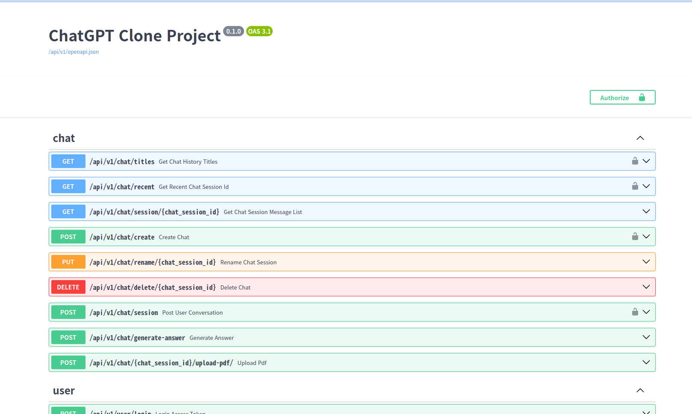
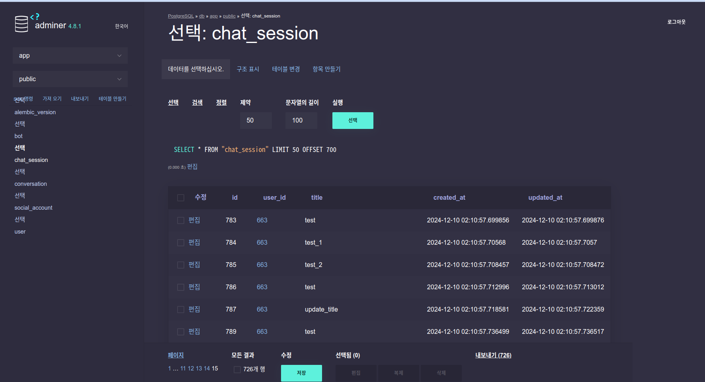
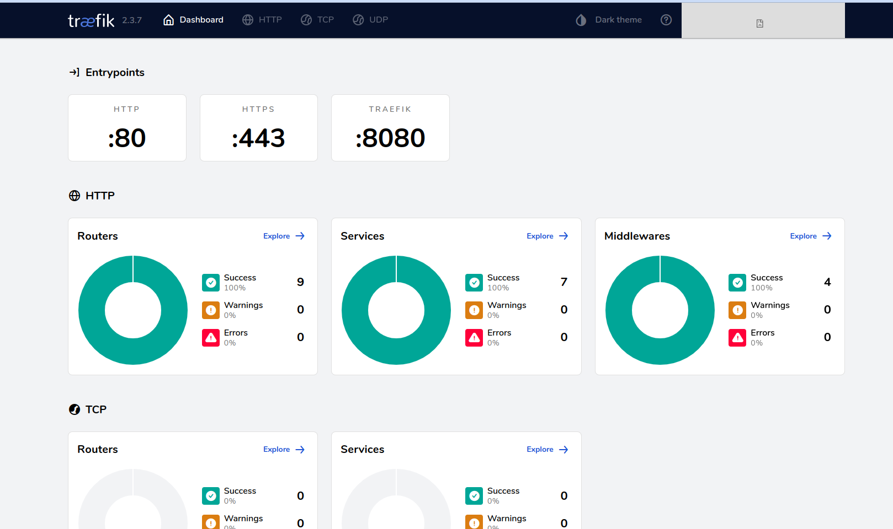

# Essay Feedback Writer Project - Backend

**언어 선택 / Language Selection:**

<p align="left">
    <a href="readme.ko.md">한국어</a>&nbsp ｜ &nbspEnglish&nbsp
</p>

## Requirements

* [Docker](https://www.docker.com/).
* [Nvidia Container Toolkit](https://docs.nvidia.com/datacenter/cloud-native/container-toolkit/latest/install-guide.html)
* [Poetry](https://python-poetry.org/) for Python package and environment management.

## Local Development

* Start the stack with Docker Compose:

```bash
docker compose up -d
```

* Now you can open your browser and interact with these URLs:

Frontend, built with Docker, with routes handled based on the path: http://localhost:5173

Backend, JSON based web API based on OpenAPI: http://localhost:8000

Automatic interactive documentation with Swagger UI (from the OpenAPI backend): http://localhost:8000/docs
[](https://github.com/limJhyeok/Essay-Feedback-Writer)


Adminer, database web administration: http://localhost:8080
[](https://github.com/limJhyeok/Essay-Feedback-Writer)

Traefik UI, to see how the routes are being handled by the proxy: http://localhost:8090

[](https://github.com/limJhyeok/Essay-Feedback-Writer)


To check the logs, run:

```bash
docker compose logs
```

To check the logs of a specific service, add the name of the service, e.g.:

```bash
docker compose logs backend
```

### General workflow

By default, the dependencies are managed with [Poetry](https://python-poetry.org/), go there and install it.

From `./backend/` you can install all the dependencies with:

```console
$ poetry install
```

Then you can start a shell session with the new environment with:

```console
$ poetry shell
```

Make sure your editor is using the correct Python virtual environment.

Modify or add SqlAchemy models for data and SQL tables in `./backend/app/models.py`, API endpoints in `./backend/app/api/`, CRUD (Create, Read, Update, Delete) utils in `./backend/app/crud.py`.

### pre-commit setting
1. Install pre-commit
```bash
apt install -y pre-commit
```
2. Apply pre-commit
```bash
pre-commit install
```

## Backend tests
To set up the test environment, run the following command:
``` console
$ docker compose -f docker-compose.yaml -f docker-compose.override.yaml -f docker-compose.test.yaml up
```
This will start the Test DB, which is isolated from the dev and prod databases.

It is recommended to use the test DB to keep the data separate during testing.

To run the backend tests, execute:

```console
$ # Start an interactive session in the backend container
$ docker compose exec backend bash

$ bash ./scripts/test.sh
```

The tests run with Pytest, modify and add tests to `./backend/app/tests/`.

If you use GitHub Actions the tests will run automatically.

### Test Coverage

When the tests are run, a file `htmlcov/index.html` is generated, you can open it in your browser to see the coverage of the tests.

## Migrations

As during local development your app directory is mounted as a volume inside the container, you can also run the migrations with `alembic` commands inside the container and the migration code will be in your app directory (instead of being only inside the container). So you can add it to your git repository.

Make sure you create a "revision" of your models and that you "upgrade" your database with that revision every time you change them. As this is what will update the tables in your database. Otherwise, your application will have errors.

* Start an interactive session in the backend container:

```console
$ docker compose exec backend bash
```

* Alembic is already configured to import your SQLModel models from `./backend/app/models.py`.

* After changing a model (for example, adding a column), inside the container, create a revision, e.g.:

```console
$ alembic revision --autogenerate -m "Add column last_name to User model"
```

* Commit to the git repository the files generated in the alembic directory.

* After creating the revision, run the migration in the database (this is what will actually change the database):

```console
$ alembic upgrade head
```

## Email Templates

The email templates are in `./backend/app/email-templates/`. Here, there are two directories: `build` and `src`. The `src` directory contains the source files that are used to build the final email templates. The `build` directory contains the final email templates that are used by the application.

Before continuing, ensure you have the [MJML extension](https://marketplace.visualstudio.com/items?itemName=attilabuti.vscode-mjml) installed in your VS Code.

Once you have the MJML extension installed, you can create a new email template in the `src` directory. After creating the new email template and with the `.mjml` file open in your editor, open the command palette with `Ctrl+Shift+P` and search for `MJML: Export to HTML`. This will convert the `.mjml` file to a `.html` file and now you can save it in the build directory.
