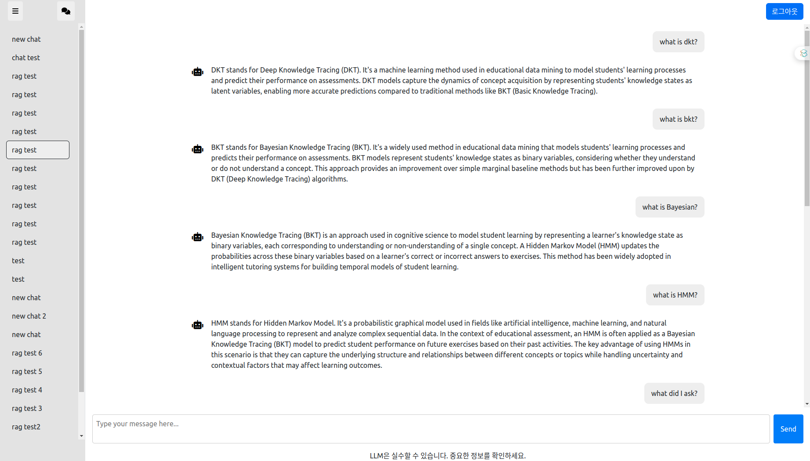

# ChatGPT Clone Project
## Project Overview
### 1. **Project Overview**

- 목적
    1. full-stack AI 개발의 전과정을 익히기 위해 ChatGPT Clone Project 진행
    2. 추후 AI 프로젝트 진행 시 원활히 협업하기 위해
    3. AI 프로젝트에 대한 큰그림을 익히기 위해
    - ChatGPT Clone Project 선정 이유
        - 기획
            - 기획 간소화
                - Clone project를 선정함으로써 기획에 필요한 여러가지 고려사항들 제외
                - 개발 실력 및 (frontend, backend, AI, 배포 및 운영)간의 협업 프로세스를 익히는데에 중점.
                - 추후 다른 AI Project를 진행할 시, 기획 또한 스스로(또는 협업자를 통해) 진행해볼 예정
        - frontend
            - UI 간소화
                - 웹페이지가 별로 없는 ChatGPT 서비스를 채택함으로써 frontend에 너무 많은 중점을 두지 않기로 함
        - backend
            - backend 간소화
                - 저장 데이터 크기 고려
                    - Text(NLP)의 경우 저장 용량이 상대적으로 가벼우므로 이에 대한 처리가 비교적 쉬울 것으로 예상
            - Chat 서비스의 경우 필요한 엔티티가 상대적으로 적을것으로 예상
                - User, Conversation(유저의 Chat 기록들), Chat(개별 Chat), (Token), (Log) 등
        - AI
            - 성공적인 AI 프로젝트
                - ChatGPT의 경우 대중에게 대표적으로 각인된 첫번째 AI 프로젝트 성공사례
            - LLM에 대한 많은 투자 및 연구 진행 중
                - ChatGPT 성공 이후 LLM에 대해 많은 연구가 진행됨에 따라 open source LLM 모델 또한 성능이 좋게 나오고 있음
            - LLM을 이용한 비즈니스 모델 확장 가능성
                - LLM의 경우 Chat bot 뿐 아니라 copilot, LLM OS 등 다양한 서비스에 적용할 수 있기 때문에 추후에도 LLM을 이용한 서비스는 지속적으로 수요가 있을 예정으로 보임
- **Scope**
    - UI 간소화
        - User가 Chat 서비스를 사용하기에 불편을 느끼지 않을 정도로만 UI 설계 및 개발
    - LLM Finetuning X
        - LLM을 Finetuning 하기에 Resource가 부족할 것으로 보임
        - 이를 보완하기 위해 여러 방안 마련 필요(e. g., Tool, RAG 등)
    - 도덕적 책임 방지
        - 개인 프로젝트일지라도 Hallucination, Prompt Injection 등 LLM의 생성 결과로 인해 발생할 수 있는 도덕적 책임을 방지하기 위해 노력할 예정이지만 User에게 명시적으로 LLM의 결과를 믿지 말라는 문구 삽입 필요
## UI
### 현재 Home page



## Project Setting

### nvidia-smi
```
+---------------------------------------------------------------------------------------+
| NVIDIA-SMI 535.183.01             Driver Version: 535.183.01   CUDA Version: 12.2     |
|-----------------------------------------+----------------------+----------------------+
| GPU  Name                 Persistence-M | Bus-Id        Disp.A | Volatile Uncorr. ECC |
| Fan  Temp   Perf          Pwr:Usage/Cap |         Memory-Usage | GPU-Util  Compute M. |
|                                         |                      |               MIG M. |
|=========================================+======================+======================|
|   0  NVIDIA GeForce RTX 4090        Off | xxxxxxxx:xx:xx.x Off |                  Off |
| --%   --C    P8              --W / 450W |      -MiB / 24564MiB |      0%      Default |
|                                         |                      |                  N/A |
+-----------------------------------------+----------------------+----------------------+
|   1  NVIDIA GeForce RTX 4090        Off | xxxxxxxx:xx:xx.x Off |                  Off |
| 30%   30C    P8              --W / 450W |      -MiB / 24564MiB |      0%      Default |
|                                         |                      |                  N/A |
+-----------------------------------------+----------------------+----------------------+
                                                                                         
+---------------------------------------------------------------------------------------+
| Processes:                                                                            |
|  GPU   GI   CI        PID   Type   Process name                            GPU Memory |
|        ID   ID                                                             Usage      |
|=======================================================================================|
|  No running processes found                                                           |
+---------------------------------------------------------------------------------------+
```
### .env 파일 setting
root 폴더 밑에 다음과 같이 .env 파일을 설정해주세요.
```
PROJECT_NAME="ChatGPT Clone Project"

# frontend
VITE_SERVER_URL=http://127.0.0.1:8000

# backend

BACKEND_CORS_ORIGINS="http://localhost,http://localhost:5173,https://localhost,https://localhost:5173"

ACCESS_TOKEN_EXPIRE_MINUTES = 60
# 인증용 secret key 및 algorithm
SECRET_KEY = 
ALGORITHM = 

SMTP_HOST = "smtp.gmail.com"
SMTP_PORT = 587
SMTP_USERNAME = "your gmail@gmail.com"
SMTP_PASSWORD = "your smtp password"

# Postgres
POSTGRES_SERVER=localhost
POSTGRES_PORT=5432
POSTGRES_DB=app
POSTGRES_USER=postgres
POSTGRES_PASSWORD=changethis

# langsmith
LANGCHAIN_TRACING_V2 = 'true'
LANGCHAIN_API_KEY = 'your langchain api key'
```
### 컨테이너 실행
```bash
docker-compose up -d
```
#### frontend/backend container bash 진입
```bash
# frontend container
docker compose exec frontend bash
# backend container
docker compose exec backend bash
```